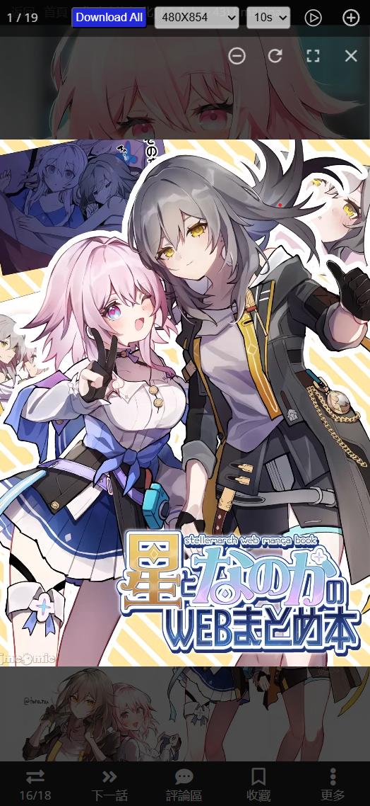

# Picture Reader

**English** | [中文](./README.zh-CN.md)

## Project Introduction

`Picture Reader` is a Chrome/Edge browser extension that extracts all images from the current webpage and displays them in a unified interface. This extension provides features such as slideshow playback, image size filtering, and batch downloading, making it easier for users to browse and manage images on webpages.

Supports most websites: Unsplash, Pexels, PIXIV, 18COMIC...

## Main Features

- **Unified Browsing of Extracted Webpage Images**: Automatically extracts all images from the current webpage and displays them in a unified interface.
- **Image Manipulation**: Supports zooming in, zooming out, and rotating images. Supports keyboard navigation, mouse wheel zooming, and dragging.
- **Slideshow Playback**: Supports timed playback of images, allowing users to set the playback interval.
- **Image Size Filtering**: Filters images based on user-defined size criteria, displaying only those that meet the criteria.
- **Batch Downloading**: Supports batch downloading of images from the current image list, making it easy for users to save and manage images. (Some sites may have restrictions and may not be available for download)
- **Mobile Browser Adaptation**: kiwi browser

## Usage Examples

## Usage Instructions

1. Load the extension in Chrome:

   - Open Chrome and go to `chrome://extensions/`.
   - Enable Developer mode in the top right corner.
   - Click the "Load unpacked" button in the top left corner and select the `dist` directory of the project.

2. Open any webpage containing images, click the extension icon in the top right corner of the browser, and use the `Picture Reader` extension to extract and browse images from the webpage.

## Features to be Added

- **Sidebar Image List Preview**: Preview all extracted images in a sidebar, allowing users to quickly browse and select images.

## Optimization Points

- **Performance Optimization**: Optimize the performance of image extraction and display to enhance user experience.
- **UI Optimization**: Improve the user interface design to make it more visually appealing and user-friendly.
- **Feature Expansion**: Add more practical features based on user feedback.
